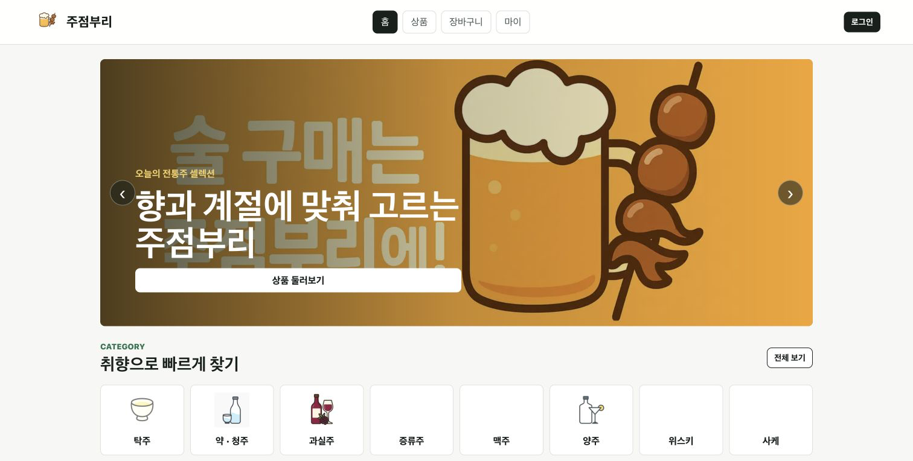
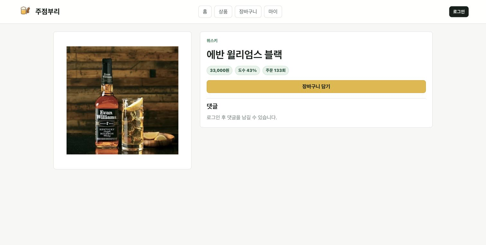

# SSAFY 13기 구미캠퍼스 5반 관통 프로젝트 Final

## 주전부리 Pubburi

주전부리(Pubburi)는 주류 상품 조회, 장바구니, 주문, 댓글, 마이페이지, 관리자 CRUD를 제공하는 웹 애플리케이션입니다.

## 주요 화면

### 홈

추천 상품과 주종별 카테고리를 한눈에 확인할 수 있습니다.



### 상품 목록

주종, 검색어, 정렬 조건으로 원하는 상품을 탐색할 수 있습니다.


### 상품 상세

상품의 가격, 도수, 주문 수를 확인하고 장바구니에 담을 수 있습니다.



## 팀원

- 오인성
- 박상윤

## 기술 스택

- Backend: Spring Boot 3, MyBatis, MySQL
- Frontend: Vue 3, Vite, Pinia, Vue Router
- Local DB: Docker Compose MySQL

## 로컬 실행

```bash
cp .env.example .env
docker compose up -d db
cd Server
set -a
source ../.env
set +a
./mvnw spring-boot:run
```

```bash
cd pubburi-vue
npm ci
npm run dev
```

## 검증

```bash
cd Server
./mvnw test
cd ../pubburi-vue
npm ci
npm run build
```

현재 기준 검증 결과는 backend 9 tests, frontend 10 tests, Vite build 통과입니다.
